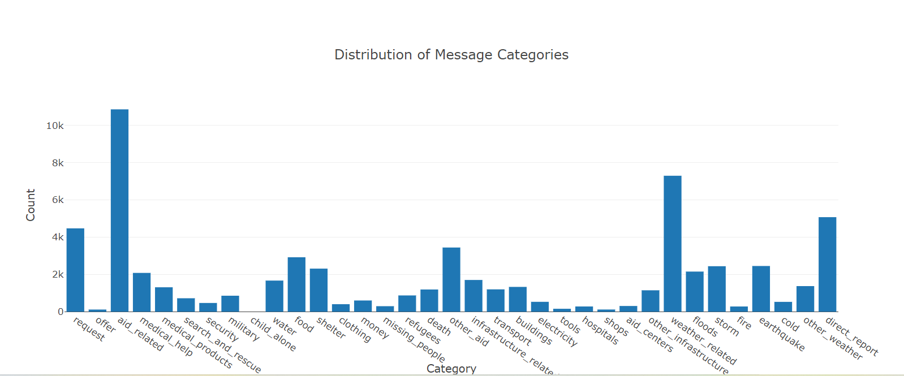

# Disaster Response Pipeline Project

## Description

This Project is part of Data Science Nanodegree Program by Udacity in collaboration with Figure Eight. The data set contains real messages that were sent during disaster events. The objective of this project is to create a machine learning model to categorize these events so that you can send the messages to an appropriate disaster relief agency.

This project has the following parts:

1. Processing data, building an ETL pipeline to extract data from source, clean the data and save them in a SQLite DB
2. Build a machine learning pipeline to train and classify text message in various categories
3. A web application which to show model results in real time

### Dependencies
* Python Libraries: NumPy, SciPy, Pandas, Sciki-Learn, nltk, pickle
* SQLlite Database library: SQLalchemy
* Web App and Data Visualization: Flask, Plotly

### Executing Program:
1. You can run the following commands in the project's directory to set up the database, train model and save the model.

    - To run ETL pipeline to clean data and store the processed data in the database
        `python data/process_data.py data/disaster_messages.csv data/disaster_categories.csv data/DisasterResponse.db`
    - To run the ML pipeline that loads data from DB, trains classifier and saves the classifier as a pickle file
        `python models/train_classifier.py data/DisasterResponse.db models/classifier.pkl`

2. Run the following command in the app's directory to run the web application.
    `python run.py`

3. Go to http://localhost:3001/

## Acknowledgements

* [Figure Eight](https://www.figure-eight.com/) for providing the dataset used for training and evaluating the model.

## Screenshots

1. This is an example of a dashbord that shows a bargraph for the distribution of message categories

2. To classify a message, type the message and click **Classify Message**, we can see the categories which the message belongs in green highlights.

